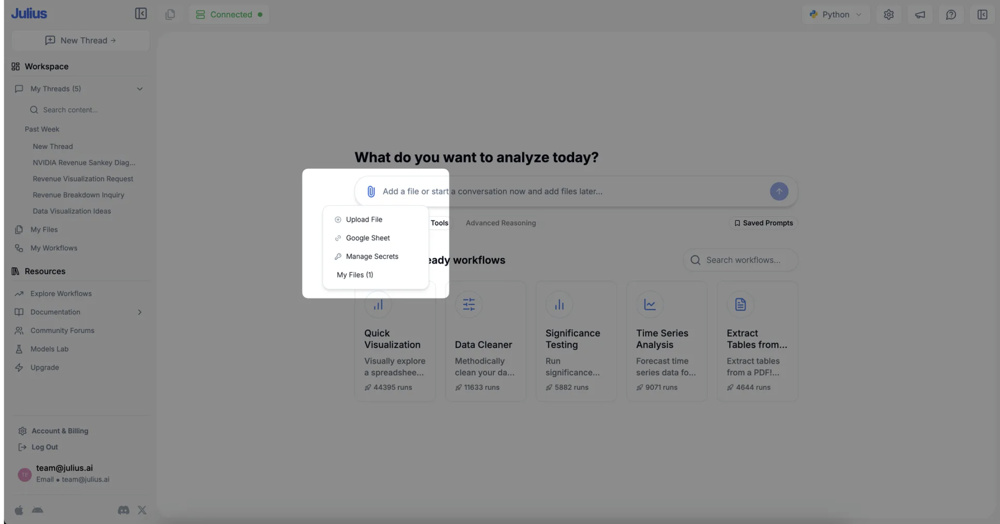
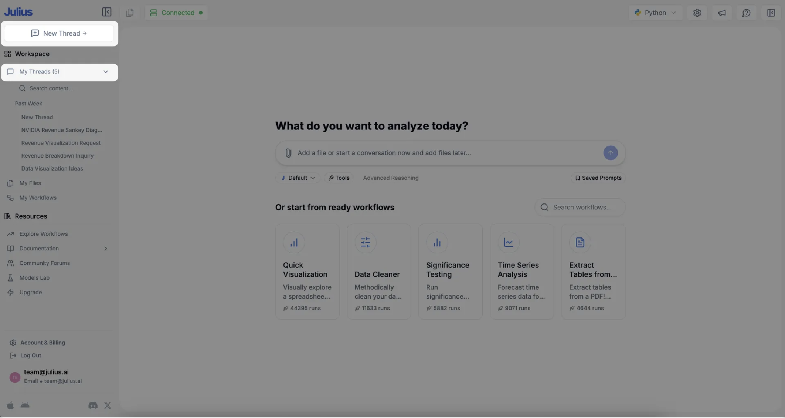
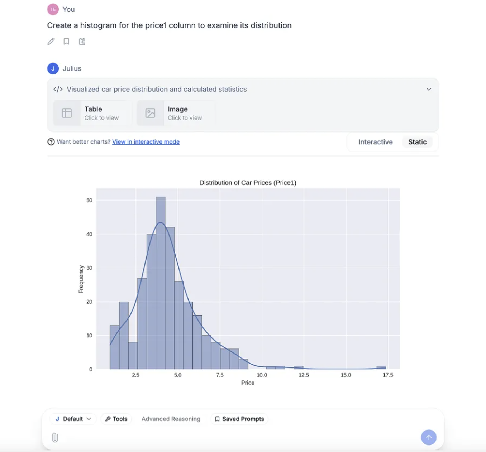
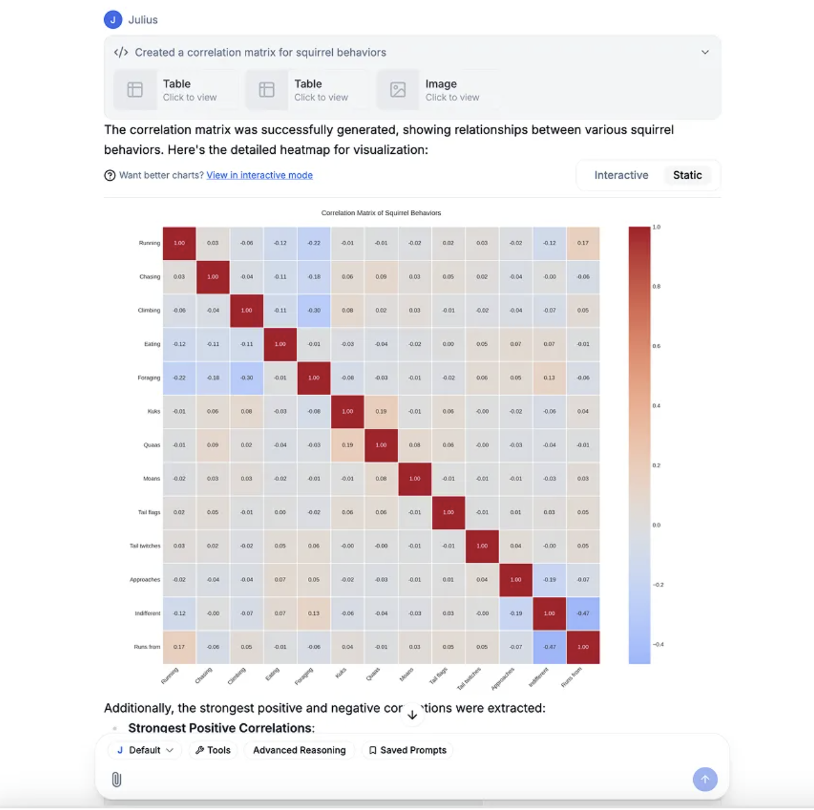
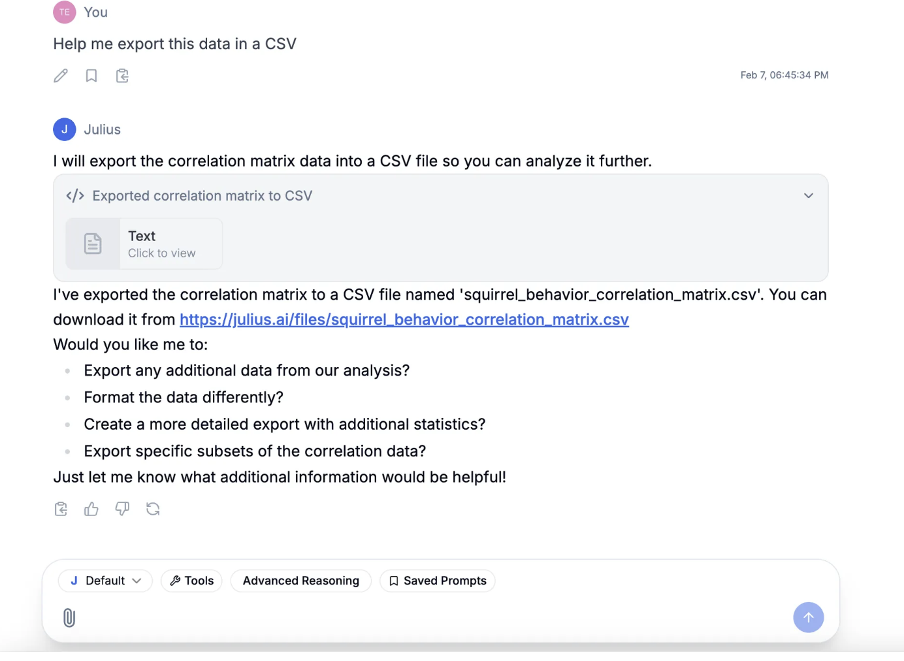

# Julius AI 官方文档汇总

**文档收集日期**: 2026年1月16日  
**来源**: https://julius.ai
## Julius AI 简介

**Julius AI** 是一个智能数据分析工具，专为知识工作者设计。它能够帮助用户进行统计分析、数据科学和计算工作，无需编写代码。

### 核心特性

- **自然语言处理**: 通过自然语言命令进行数据分析
- **多模型支持**: 使用各种大型语言模型（LLMs），为每项任务选择最优模型
- **代码生成**: 根据用户提示自动生成 Python 代码
- **数据可视化**: 支持多种图表类型的可视化
- **多数据源支持**: 支持 CSV、Excel、PDF、JSON、Google Sheets、Postgres 等多种格式

### 公司信息

- **公司名称**: Caesar Labs, Inc.
- **总部**: 旧金山
- **使命**: 为知识工作者构建最强大的 AI 工具
- **认证**: SOC 2 Type 2 Certified

---

## 快速入门指南

### 第一步：链接数据源

1. 进入 **My Files** 标签页
2. 点击屏幕中央的 **"Upload File"** 按钮
3. 选择上传文件选项以上传任何类型的文件格式：
   - CSV 或 Excel 文件
   - JSON 文件
   - 多媒体文件
   - 其他格式
4. 或者，选择 **Share from URL** 以连接 Google Sheet
5. 上传或提交后，数据源将出现在数据源列表中


### 第二步：创建对话

1. 添加数据源后，点击 **"My Threads"** 查看现有对话
2. 点击 **"New Chat"** 创建新对话
3. 

### 第三步：设置活动数据源

1. 点击 **"Add file"** 按钮选择现有数据源或添加新数据源
2. 输入初始指令
3. 按蓝色箭头按钮发送消息并启动第一次聊天


### 第四步：分析和转换数据

链接数据源并启动对话后，可以使用自然语言命令要求 Julius 分析和转换数据。

**示例命令**:
- "Show me the average sales by product category"（按产品类别显示平均销售额）
- "Sort the data by customer age"（按客户年龄排序数据）
- "Add a new column for profit"（添加利润列）

Julius 将命令转换为 Python 代码并应用于数据。支持的操作包括：
- 筛选（Filtering）
- 排序（Sorting）
- 聚合（Aggregating）
- 回归分析（Regressions）
- 以及任何 pandas dataframe 支持的操作
- 

### 第五步：数据可视化

Julius 可以根据数据创建各种类型的可视化：

| 图表类型 | 用途 | 示例命令 |
|---------|------|--------|
| **柱状图** | 比较不同类别的数量 | "Show me a bar plot of sales by product category" |
| **折线图** | 显示时间趋势 | "Show me a line plot of sales over time" |
| **直方图** | 显示变量分布 | "Show me a histogram of customer ages" |
| **散点图** | 显示两个变量之间的关系 | "Show me a scatter plot of age versus income" |
| **饼图** | 显示类别比例 | "Show me a pie chart of sales by region" |

生成的图表将在聊天中显示，用户可以右键点击图像进行复制或保存。


### 第六步：导出数据

如果对数据进行了更改并想要导出：

1. 告诉 Julius 导出数据
2. 提供导出文件的名称
3. 指定首选数据格式：
   - CSV 文件
   - Excel 文件
4. 聊天中将生成一个链接，导向包含下载按钮的页面
5. 

---

## 常见问题解答

### Julius AI 是什么？

Julius 是一个为统计分析、数据科学和计算设计的 AI 助手。它使用各种大型语言模型（LLMs），为每项任务找到最佳模型，并根据用户提示编写代码来分析数据。最终结果是一种直观的数据分析和可视化方式，无需编码，使统计分析对所有人都可访问。

### 如何使用 Julius AI？

1. 上传数据：使用聊天页面的回形针图标添加文件
2. 支持的格式：CSV、Excel、PDF、JSON 和图像
3. 上传后，文件在工作区中作为数据源可用
4. 使用自然语言要求 Julius 分析或转换数据
5. 示例：
   - "Summarize this dataset"（总结此数据集）
   - "Create a scatter plot"（创建散点图）
   - "Run a one-way ANOVA"（运行单因素方差分析）

### 如何链接数据源？

可以在 **My Files** 页面或直接在 **Chat 界面**中链接数据源。详细说明请查看 Julius Start Guide。

### 我可以分析有多个标签页的电子表格吗？

是的。像上传任何其他文件一样上传多标签电子表格。上传后，可以在提示中引用各个标签的名称，Julius 将对这些标签执行分析。

### 链接数据源后我应该做什么？

链接数据源后，可以在 **Chat** 页面上使用自然语言提示进行分析。尝试要求获取见解或指导 Julius 创建可视化。有关如何使用 Julius 的其他示例，请查看 **Guides** 部分。

### 学生、教授或教师有折扣吗？

是的。Julius 为学生和其他学术界成员提供 **50% 折扣**。注册后，在订阅前向 team@julius.ai 发送快速电子邮件说明您是学生，Julius 将告知如何将 50% 折扣应用于您的账户。

### 我可以在 Julius 中做什么？

**连接数据**:
```
Link https://docs.google.com/spreadsheets/d/xyz
```

**列出数据**:
```
What data sources do I have?
```

**操作数据**:
```
Add a new column for profit
```

**分析数据**:
```
What was our average revenue per month?
```

**可视化数据**:
```
Show me sales over time in a chart
```

**下载转换后的数据**:
```
Export that to a CSV and give me a download link
```

更多示例请查看 **Guides 部分**或 **How-to Video Tutorial Library**。

### Julius AI 可靠吗？

Julius AI 根据用户请求生成代码来分析数据。代码本身 100% 准确，所使用的底层统计库经过充分测试和可靠。结果的准确性取决于 AI 对需求的解释程度。

**获得最准确结果的建议**:
1. 确保数据格式正确
2. 对分析要求具体
3. 如果需要，提供关于数据特征的关键信息

### 支持哪些数据源？

目前支持任何数据文件格式，包括但不限于：
- 电子表格（.xls、.xlsx、.xlsm、.xlsb、.csv）
- Google Sheets
- Postgres 数据库
- 其他格式（可在 Julius Chat 中尝试上传）

### Julius AI 免费吗？

是的。默认情况下，所有用户每月可以使用较低级别的 AI 模型发送最多 15 条消息。达到月度限制后，可以在 **Account** 页面升级计划。

**费率限制**:
- **Free 层**: 15 条消息/月
- **Plus**: 250 条消息/月
- **Pro**: 无限消息

### Julius AI 何时重置速率限制？

速率限制在每月 1 日对所有用户层进行重置。

### Julius AI 不适合我。我应该怎么办？

首先，确保电子表格 **格式正确**。如果仍有问题，请通过以下方式联系：
- 发送电子邮件至 team@julius.ai
- 点击屏幕右下角的帮助信标

### Julius AI 安全吗？

Julius 实施多层安全措施来保护数据和个人信息：

- **访问控制**: 严格的访问控制系统确保每个用户只能访问自己的数据
- **沙盒环境**: Python 代码执行环境按用户单独沙盒化
- **数据删除**: 在应用中删除数据时，它会从服务器上完全删除
- **审计日志**: 自动审计日志跟踪所有数据查询
- **员工管理**: 严格的员工访问控制
- **培训**: 要求团队成员进行年度隐私培训

详见 **Julius Privacy Policy**。

### Julius 的数据隐私和安全政策是什么？

Julius 采用严格的访问控制，每个用户只能访问安全笔记本文件存储中自己的数据。即使 Python 代码执行环境也按用户沙盒化。此外，在应用中删除数据时，数据会从服务器上完全删除。

详见 **Julius Privacy Policy**。

---

## 使用指南

Julius AI 提供了多个行业和学科的专业指南：

### 可用指南列表

| 领域 | 指南标题 |
|------|--------|
| **生态学** | How to Perform a Kruskal-Wallis test in Julius |
| **市场营销** | How to Perform a Paired Samples T-Test |
| **生物信息学** | How to Create a Correlation Matrix & Analyze Gene Expression |
| **营养科学** | How to run a One-way Analysis of Variance (ANOVA) |
| **人口统计学** | How to Prepare Your Data and Run Descriptive Statistics with Julius |
| **经济学** | How to Perform Exploratory Data Analysis with Julius |
| **医疗保健** | Unlocking Healthcare Data Insights with Julius AI |
| **市场营销** | How to use AI to Optimize Marketing Campaigns |
| **学术界** | How to Perform Spatial Analysis with Animal Movement Data |

### Julius 是什么

Julius AI 是一个智能数据分析工具，以直观、用户友好的方式解释、分析和可视化复杂数据。它的强大之处在于使数据分析对所有人都可访问和可操作，即使对于非数据科学家或统计学家也是如此。
